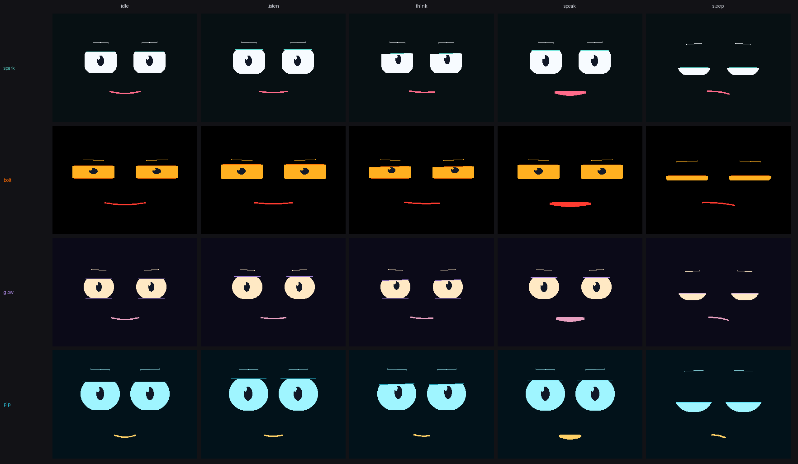

# Customizing The Procedural Face

Stackchan: Alive draws its face from geometry every frame. There are no required face
sprites, image sequences, or expression bitmaps. A custom face can therefore keep the
same blink, gaze, emotion, speech-mouth, and reduced-motion behavior while changing how
the character looks.

Stackchan ships with four faces. They are all the same engine; every difference below is
YAML, not C++:



There are two supported customization levels:

1. **Persona tuning** changes the palette, face geometry, and expression values in YAML.
   This is the recommended path for most creators and does not require C++ changes. It is
   enough to produce a face nobody would mistake for the reference one.
2. **Engine skinning** changes the procedural eye, mouth, pose, or transition *code*. Use
   this only when the character needs a different face *language* — a third eye, an
   eyebrow that is its own shape, a mouth that is not a curve.

Start with persona tuning. Move into engine skinning only after the persona passes its
validator and looks coherent in every runtime mode.

## How A Frame Is Built

The face pipeline is layered in this order:

1. `ExpressionMapper` turns emotion and mode into a `FaceTargets` baseline.
2. `FaceAnimator` chooses the mode pose, then adds blink, saccade, breathing, transition,
   event, and speech-viseme layers.
3. `ProceduralFace` converts the composed targets into `EyeGeometry` and `MouthGeometry`.
4. `DisplayAdapter` draws those shapes into the display canvas and flushes the dirty area.

This separation is important. A creator describes a target expression; the shared engine
keeps it alive and moves toward it smoothly. Do not animate values from a persona YAML file
or add a second display loop.

## Quick Start: Tune A Persona Face

Create a persona by copying the validated reference pack:

```powershell
$author = Read-Host "Name or handle to credit"
.\tools\create_persona_pack.cmd nova -Name "Stackchan Nova" -Author $author
```

Edit:

```text
personas/nova/expressions.yaml
personas/nova/behavior.yaml
```

Then validate and build with that persona selected:

```powershell
.\tools\verify_persona_pack.cmd nova --Json
$env:STACKCHAN_PERSONA = "nova"
pio test -e native_logic
pio run -e stackchan
```

The PlatformIO pre-build step validates the pack and generates:

```text
.pio/build/<environment>/generated/PersonaExpressions.hpp
.pio/build/<environment>/generated/PersonaBehavior.hpp
.pio/build/<environment>/generated/PersonaFace.hpp
```

These files are generated output. Edit the YAML source, not the generated headers.

## See It Before You Flash

You do not have to guess, and you do not have to flash to find out. The preview renderer
drives the same drawing code the firmware uses, so what it renders is what the panel shows.

Render every installed persona into one comparison sheet:

```bash
python tools/render_face_gallery.py
```

Render only the one you are working on:

```bash
python tools/render_face_gallery.py nova
```

That writes `docs/media/face_gallery.png` and a per-persona strip at
`docs/media/face_<id>.png`, each showing the idle, listen, think, speak, and sleep poses.
Edit YAML, re-run, look. The loop takes seconds and needs no hardware.

Preview dependencies are small:

```bash
python -m pip install -r requirements-preview.txt
```

## The Face Block: Palette And Geometry

`personas/<id>/expressions.yaml` has a `face:` block that controls what the character
actually looks like. The display is 320x240 and the origin is top-left.

```yaml
face:
  palette:
    background: "0x071013"   # field the face is drawn on
    eye: "0xF7FBFF"          # eye fill
    mouth: "0xFF6B8A"        # mouth stroke
    accent: "0x61E4D7"       # lid edge highlight and preview labels
  eyes:
    center_y: 104            # vertical centre of both eyes
    spacing: 108             # distance between the two eye centres
    width: 70
    height: 56
    corner_radius: 18        # 0 is a hard rectangle, height/2 is a full capsule
  mouth:
    center_y: 172
    width: 64
```

| Field | Range | What it changes |
| --- | --- | --- |
| `palette.background` | `0x000000`-`0xFFFFFF` | Whole-screen field colour |
| `palette.eye` | `0x000000`-`0xFFFFFF` | Eye fill; the single strongest identity cue |
| `palette.mouth` | `0x000000`-`0xFFFFFF` | Mouth stroke colour |
| `palette.accent` | `0x000000`-`0xFFFFFF` | Lid edge highlight |
| `eyes.center_y` | on-screen | Eyes high reads younger; low reads heavier |
| `eyes.spacing` | 40-260 px | Wide-set reads machine-like; close-set reads small and young |
| `eyes.width` | 20-140 px | |
| `eyes.height` | 12-130 px | Short and wide becomes a visor slit; tall becomes a wide-eyed stare |
| `eyes.corner_radius` | 0 to `height/2` | The fastest way to change character: hard corners read mechanical, full capsules read soft |
| `mouth.center_y` | below the eyes | Distance from the eyes changes apparent face length |
| `mouth.width` | 16-200 px | |

Colours accept `0xRRGGBB`, `#RRGGBB`, or bare `RRGGBB`. Every value is clamped by the
generator, so a hand-edited pack cannot place an eye off the edge of the panel — but it can
still look wrong, which is what the gallery is for.

### Three levers that do most of the work

If you change nothing else, change these:

1. **`corner_radius`** — hard rectangle versus capsule is the difference between Bolt and Pip.
2. **`eyes.height`** relative to `width` — a 92x34 slit and an 86x74 oval are not the same
   creature.
3. **`palette.eye` against `palette.background`** — cold white on near-black, warm amber on
   black, and pale cyan on deep teal all read as different machines.

## How A Persona Breathes

`personas/<id>/behavior.yaml` carries a `breathing:` block. Breathing is a large part of
whether a face reads as alive, and it is worth tuning alongside the geometry.

```yaml
breathing:
  period_jitter: 0.18      # 0.0 is a metronome, which reads as machinery
  depth_jitter: 0.14
  exhale_fraction: 0.48    # exhale longer than inhale reads restful
  hold_fraction: 0.12      # still pause at the bottom of the breath
  sigh_min_cycles: 7       # a deeper breath every 7-21 breaths
  sigh_cycle_span: 14
  sigh_depth: 1.7
```

Sigh timing is counted in breaths, not seconds, so a persona with a slow `breathing_hz`
also sighs less often without extra tuning.

## The Four Shipped Faces

These are worked examples. Copy the one closest to what you want and edit from there.

| Persona | Look | Face values that make it | Breathing |
| --- | --- | --- | --- |
| `spark` | Crisp white rounded rectangles on near-black. The reference. | `70x56`, radius `18`, spacing `108` | 0.20 Hz, ordinary jitter, sighs every 7-21 breaths |
| `glow` | Warm cream capsules on deep indigo. Softer and calmer. | `66x52`, radius `26`, spacing `116`, lower `center_y` | 0.16 Hz, low jitter, long hold, rare soft sighs |
| `pip` | Big pale-cyan ovals set high, small amber mouth. Young and curious. | `86x74`, radius `37` (full capsule), spacing `110`, `center_y 96` | 0.28 Hz, high jitter, frequent catch-breaths |
| `bolt` | Wide-set amber visor slits with hard corners on pure black. Machine-like. | `92x34`, radius `3`, spacing `140` | 0.11 Hz, almost no jitter, long hold, rare shallow sighs |

Build and flash any of them by name:

```bash
STACKCHAN_PERSONA=bolt pio run -e stackchan_release_full
```

On Windows:

```powershell
$env:STACKCHAN_PERSONA = "bolt"
pio run -e stackchan_release_full
```

The persona is selected at build time, so the face is fixed in the image. Swapping faces at
runtime is a separate, unimplemented feature — see `docs/PERSONA_PACKS.md`.

## Expression Sections

The reference file is `personas/spark/expressions.yaml`. Keep its required sections while
tuning values:

| Section | What it expresses | Current runtime connection |
| --- | --- | --- |
| `neutral` | Resting eye openness, eye smile, and mouth smile | Direct baseline used by `ExpressionMapper` |
| `listen` | Focus metadata and small pitch attention bias | Pitch bias is wired; `focus` is validated/generated but not yet consumed, and the detailed listen pose remains in `FaceAnimator` |
| `think` | Upward/downward thought gaze and small yaw bias | Pupil Y and motion bias |
| `drowsy` | Fatigue-heavy lids, squint, brow, mouth, and face drop | Blended in as fatigue rises |
| `yawn` | Timed eye, squint, mouth, and pitch deltas | Layered by `IdleLife` |
| `surprise` | Alert reflex target | Authored target; advanced mode/event styling is still implemented in C++ |
| `picked_up` | Lift/startle target | Authored target; pickup behavior remains foundation-controlled |
| `shaken` | Safety/startle target | Authored target; safety behavior remains foundation-controlled |
| `put_down` | Relief/settling target | Authored target; event behavior remains foundation-controlled |
| `tilted` | Orientation mismatch target | Authored target; IMU behavior remains foundation-controlled |
| `sound_direction` | Eyes-first sound orientation and yaw bias | Yaw bias is wired; detailed face reflex remains foundation-controlled |
| `loud_noise` | Short alert/startle target | Authored target; event behavior remains foundation-controlled |

The distinction in the last column is deliberate. The generator accepts the authored
targets so the pack format has one expression language, but only the explicitly listed
runtime connections should be expected to alter the current production face without a C++
engine change.

## Face Values

The common generated pose fields use normalized values unless marked as pixels:

| YAML field | Generated range | Visual effect |
| --- | ---: | --- |
| `eye_open` | `0.02` to `1.20` | `0` is closed; about `0.85` is a relaxed open eye; values above `1` read as startled |
| `eye_smile` | `0.00` to `1.00` | Raises the lower lid and softens the eye |
| `squint` | `0.00` to `1.00` | Narrows eye width and strengthens the brow read |
| `brow_tilt` | `-1.00` to `1.00` | Tilts the procedural brow; test both eyes because the tilt is mirrored |
| `mouth_smile` | `-1.00` to `1.00` | Negative curves down, positive curves up |
| `mouth_open` | `0.00` to `1.00` | Opens the filled speech/yawn mouth |
| `pupil_x`, `pupil_y` | `-1.00` to `1.00` | Moves pupils inside the current eye geometry |
| `pupil_scale` | `0.50` to `1.50` | Changes pupil size; large values feel alert or affectionate |
| `face_x`, `face_y` | `-12.00` to `12.00` px | Offsets the whole face before autonomic motion is added |

Some advanced `FaceTargets` fields are currently C++ only: `eyeWidthScale`, lid tilts,
mouth width and corner offsets, and independent corner cuts for each eye. Those controls
are described in the engine-skinning section.

Tune one visual idea at a time. For example, this is a calm, friendly baseline with a
clearer fatigue pose:

```yaml
neutral:
  eye_open: 0.82
  eye_smile: 0.22
  mouth_smile: 0.24
listen:
  focus: 0.94
  pitch_bias_deg: -2.0
think:
  pupil_y: -0.14
  yaw_bias_deg: 10.0
drowsy:
  perceptual_purpose: eyelids become heavy while the smile settles
  eye_open: 0.52
  squint: 0.12
  brow_tilt: -0.05
  mouth_smile: 0.08
  face_y: 1.2
```

Keep the descriptive `perceptual_purpose` notes. They do not change firmware, but they make
future edits easier to judge: every number should support the same readable intent.

## Idle Life And Transitions

Use `behavior.yaml` for the rhythm around the face:

- `idle_life.breathing_hz` controls the breathing cycle rate.
- `idle_life.breathing_px` controls whole-face vertical breathing amplitude.
- `idle_life.fidget_min_ms` and `fidget_max_ms` bound occasional micro-expressions.
- `idle_life.reduced_motion_scale` preserves character while reducing autonomic movement.

Blink timing, saccade timing, mode poses, and transition gestures are shared engine behavior
in `src/face/FaceAnimator.cpp`. Keeping them in one animator prevents a persona from
creating rapid flashing, constant motion, or a second timing system that competes with the
bridge and microphone tasks.

For advanced transition changes, edit one transition at a time and preserve these rules:

- Mode changes must ease into a target; do not snap the complete pose in one frame.
- A blink may accent a transition, but repeated full-eye flashes are not an expression.
- Pupils should normally lead a whole-face or servo orientation response.
- Reduced-motion mode must remain recognizable and complete.
- Speech onset suppresses a scheduled blink briefly so eye contact and mouth motion stay
  readable.

## Speech Mouth And Visemes

Speech animation is driven by a normalized audio envelope plus four bounded visemes:
`Neutral`, `Ah`, `Oh`, and `Ee`. `FaceAnimator::applyReactive` changes mouth opening, width,
smile, and corners for each viseme, then smooths those values. A persona does not generate
per-frame mouth commands.

When skinning the mouth:

- Keep `mouth_open = 0` visually closed with no filled mouth body.
- Keep all four visemes distinct at small display size.
- Preserve a clean return to neutral after the final audio frame.
- Never perform audio decoding, allocation, or file I/O in the face renderer.
- Validate a complete reply, not only a short test word, so truncation and stale-open-mouth
  failures are visible.

## Preview Before Flashing

Install the preview dependencies and generate the reference animation suite:

```powershell
python -m pip install -r requirements-preview.txt
python tools/render_preview.py
.\tools\verify_preview_media.cmd
```

The output includes the idle animation, expression sheet, mode-transition filmstrips, and
speech-reactive preview under `docs/media/` and `artifacts/face/`.

The current preview script is a renderer/animation reference, not a parser for a selected
persona pack. Use it to inspect advanced geometry or transition edits. For YAML-only persona
tuning, the generated `PersonaExpressions.hpp`, native tests, and a display-only device run
are the authoritative checks.

## Advanced Engine Skinning

These files define the deeper visual language:

- `src/persona/StateMatrix.hpp`: all `FaceTargets` channels.
- `src/face/FaceAnimator.cpp`: mode poses, smoothing, transitions, blink, gaze, fidgets,
  and speech visemes.
- `src/face/ProceduralFace.cpp`: base eye positions and sizes plus mouth placement.
- `src/face/EyeGeometry.hpp` and `MouthGeometry.hpp`: renderer-facing geometry contracts.
- `src/io/DisplayAdapter.cpp`: colors and the actual procedural drawing operations.
- `tools/render_preview.py`: host-side visual reference that should track renderer changes.

Useful advanced controls include:

- `eyeWidthScale` for wide or narrow eye silhouettes.
- `upperLidTilt` and `lowerLidTilt` for asymmetrical lid lines.
- `leftCorners` and `rightCorners` for cutting individual eye corners.
- `mouthWidthDelta` for compact versus broad mouth shapes.
- `mouthCornerL` and `mouthCornerR` for asymmetrical mouth attitude.
- `faceX` and `faceY` for subtle whole-face staging.

Change the matching host preview whenever procedural drawing changes. A preview that looks
right while the firmware renderer differs is not a valid customization workflow.

## Performance And Stability Invariants

Face customization must preserve the runtime that keeps the physical robot stable:

- Only the face task may draw to the display.
- Do not add a second renderer, display task, or direct display writes from bridge, sensor,
  camera, audio, or persona code.
- Keep drawing bounded and allocation-free per frame.
- Keep the dirty-region renderer and one display wait/flush per composed frame.
- Preserve the normal 33,333 microsecond frame budget telemetry.
- The strict acceptance ceiling is `display_window_max_frame_us <= 50000` during a combined
  system run. A custom face that exceeds it is not release-ready.
- Do not treat one good screenshot as validation. Watch for flicker, black frames, stale
  regions, frozen eyes, missed mouth closure, and bridge/audio starvation.

Run the face and architecture checks after an advanced edit:

```powershell
.\tools\verify_face_phase_a.cmd
.\tools\verify_face_phase_b.cmd
.\tools\verify_face_phase_c.cmd
.\tools\verify_face_phase_d.cmd
.\tools\verify_face_phase_e.cmd
pio test -e native_logic
pio run -e stackchan
```

## Device Acceptance Checklist

Use display-only firmware before combining the custom face with wake, Wi-Fi, camera, audio,
or servos. Confirm:

- The face boots without a white, black, or partially drawn flash.
- Idle breathing and saccades feel alive without looking restless.
- Blinks close and reopen cleanly with no full-screen flicker.
- Listen, think, speak, react, sleep, and error remain visually distinct.
- Pupils stay inside the eye silhouette at their extreme positions.
- Every viseme reads clearly and the mouth closes after speech.
- Reduced-motion mode still communicates every state.
- The face remains smooth during a complete bridge reply.
- Frame telemetry remains under the strict 50 ms ceiling in the final combined soak.

Archive the selected persona folder, generated firmware hash, preview artifacts, native test
result, and physical acceptance notes together. That makes a custom face reproducible instead
of leaving it as an untracked set of numbers.
